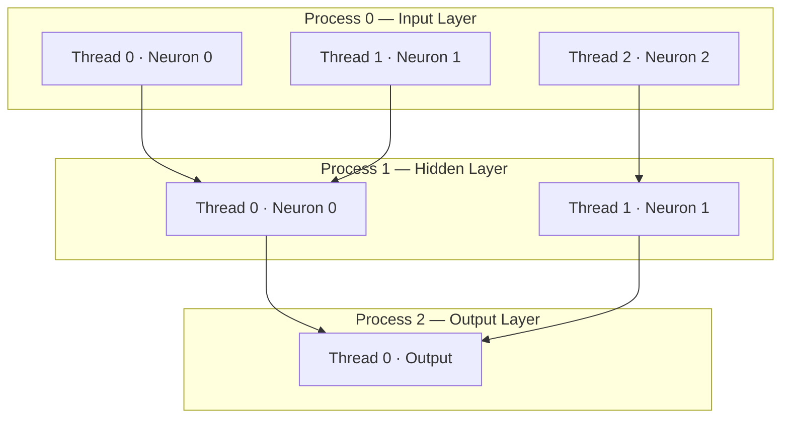

# Multi-Core Neural Network in C++

> **A neural network where every layer is a process and every neuron is a thread** — built from scratch in C++ using POSIX multi-processing and multi-threading.

[](https://isocpp.org/)
[]()
[]()
[]()

---

## What Is ParallelNet?

Most neural network frameworks treat parallelism as an optimization bolted on afterward. ParallelNet bakes it into the architecture itself — the network's computational structure **maps directly onto OS-level concurrency primitives**:

| Neural Network concept | OS / hardware concept |
|------------------------|----------------------|
| Layer | Process |
| Neuron / node | Thread |
| Weighted connection | Inter-thread message / shared memory |
| Forward pass | Pipeline of communicating processes |

Every neuron runs as its own thread within its layer's process. Inter-neuron communication (weighted sums, activation) is handled via synchronization primitives across threads, and inter-layer communication is handled across processes — making this a true **multi-core** implementation that distributes real computation across CPU cores.

---

## Architecture



**Each process** owns one layer and manages its neurons as a thread pool.  
**Each thread** computes one neuron's weighted sum, applies activation, and passes its output to the next layer's process.  
**Synchronization** ensures threads within a layer complete before the next layer's process begins.

---

## Key Design Decisions

### Layer = Process
Each layer spawns as a separate OS process. This maps layers onto distinct memory spaces and CPU scheduling units, enabling the OS to distribute layers across physical cores automatically.

### Neuron = Thread
Within each process, every neuron runs as an independent thread. Threads share the layer's weight matrix via shared memory, compute their dot product concurrently, then synchronize at a barrier before passing activations forward.

### Weight Encoding
Weights are stored as a flat comma-separated file (`weights.csv`). At startup, each layer's process reads its slice of weights and distributes them to its neuron threads. This makes the network architecture data-driven — changing the weight file changes the network's connectivity without recompiling.

**Sample weight format** (first few values from a 3-layer network):
```
0.1,-0.4,-0.2,0.5,0.3,0.6,0.1,-0.4,-0.2,0.5,0.3,0.6,...
```

---

## Project Structure

```
.
├── main.cpp              # Entry point — spawns layer processes, coordinates pipeline
├── neuron.cpp / .h       # Thread function: weighted sum + activation
├── layer.cpp / .h        # Process wrapper: spawns neuron threads, manages sync
├── weights.csv           # Flat weight matrix for all layers
├── network.cfg           # (if present) Layer sizes and activation functions
└── README.md
```

---

## Getting Started

### Prerequisites

- GCC 9+ or Clang 10+ with C++17 support
- POSIX-compliant OS (Linux or macOS)
- `pthread` library (standard on Linux/macOS)

### Build

```bash
git clone https://github.com/Syed-Abdul-Rehman-Nasir/MultiCore-Neural-Network-main.git
cd MultiCore-Neural-Network-main/MultiCore-Neural-Network-main
g++ -std=c++17 -O2 -pthread -o parallelnet main.cpp neuron.cpp layer.cpp
```

### Run

```bash
./parallelnet
```

The network reads weights from `weights.csv` on startup, spawns one process per layer, and performs a forward pass with the configured input.

---

## Concurrency Model

```
main process
    │
    ├── fork() ──▶ Layer 0 process
    │                  ├── pthread_create() ──▶ Neuron 0 thread
    │                  ├── pthread_create() ──▶ Neuron 1 thread
    │                  └── pthread_barrier_wait() ── sync before output
    │
    ├── fork() ──▶ Layer 1 process
    │                  ├── pthread_create() ──▶ Neuron 0 thread
    │                  ├── pthread_create() ──▶ Neuron 1 thread
    │                  └── pthread_barrier_wait()
    │
    └── fork() ──▶ Output Layer process
                       └── pthread_create() ──▶ Output Neuron thread
```

- **Inter-layer** (process-to-process): activations passed via pipes or shared memory segments
- **Intra-layer** (thread-to-thread): weight access via shared memory, synchronized with `pthread_mutex` or `pthread_barrier`
- **Forward pass completes** when all layer processes exit and the main process collects results

---

## What This Demonstrates

| Concept | Implementation |
|---------|---------------|
| OS process management | `fork()` / `exec()` per layer |
| POSIX threading | `pthread_create` per neuron |
| Thread synchronization | Barriers and mutexes between neurons |
| IPC (inter-process communication) | Pipes or shared memory between layers |
| Data-driven architecture | Weight matrix loaded at runtime from CSV |
| Parallel forward pass | All neurons in a layer compute concurrently |

This project is a ground-up demonstration that neural network forward passes are **embarrassingly parallel within a layer** — neurons have no data dependency on each other, only on the previous layer's outputs — making the thread-per-neuron model both correct and efficient.

---

## Limitations & Future Work

| Area | Note |
|------|------|
| Backpropagation | Forward pass only in current version; gradient computation not yet parallelized |
| Activation functions | Sigmoid/ReLU — extend in `neuron.cpp` |
| Dynamic topology | Layer sizes currently fixed at compile/config time |
| Benchmark suite | Speedup vs. single-threaded baseline not yet measured formally |
| GPU extension | Architecture maps naturally onto CUDA blocks (block = layer, thread = neuron) |

---

## Why This Matters

Most CS students implement neural networks as sequential nested loops. This project asks: *what if the computational graph were also the process graph?* The answer reveals something fundamental — that the layer-wise structure of feed-forward networks is a natural fit for process pipelines, and that neuron independence within a layer is exactly the property that makes data parallelism work in frameworks like PyTorch and TensorFlow under the hood.

This is a systems + ML crossover project: it requires understanding both neural network mathematics and OS-level concurrency, and it shows how the two disciplines meet in production deep learning infrastructure.

---

## Suggested Repo Name

The current name `MultiCore-Neural-Network-main` reads like a zip file was uploaded directly. Here are cleaner alternatives:

| Name | Why |
|------|-----|
| **`parallelnet-cpp`** | Descriptive, searchable, language is clear |
| **`neuron-as-thread`** | Communicates the core architectural idea immediately |
| **`layerwise-parallel-nn`** | Precise about what's actually parallel |
| **`process-layer-nn`** | Maps directly to the design (layer = process) |
| **`concurrent-nn-cpp`** | Straightforward for recruiter keyword searches |

**Recommended: `parallelnet-cpp`** — short, memorable, and tells you the language without being verbose.
